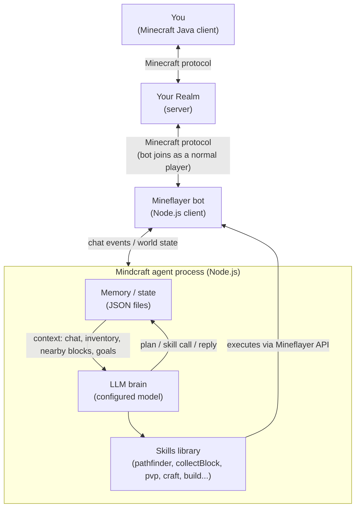
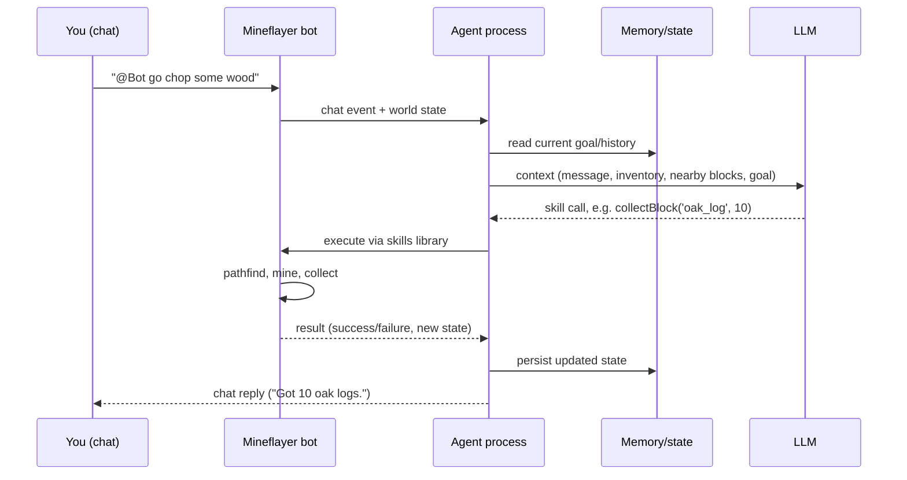

# Architecture

## Components

1. **Minecraft Realm** — the existing Java Edition realm, unmodified. No plugins or mods needed server-side.
2. **Bot account** — a second Microsoft/Minecraft account, invited to the realm like any other player. Mineflayer authenticates as this account.
3. **Mineflayer client** — a Node.js process that logs in via Microsoft auth and speaks the Minecraft protocol directly. To the server it looks like a normal player.
4. **Skills library** — functions built on Mineflayer plugins (`mineflayer-pathfinder`, `mineflayer-collectblock`, `mineflayer-pvp`, etc.): `goToPlayer()`, `collectBlock()`, `craftItem()`, `attackNearest()`, and so on.
5. **LLM brain** — on each chat command or decision tick, packages up context (message, inventory, nearby blocks/entities, current goal) and sends it to the configured model, which returns a skill call or short generated snippet to execute. See [model-options.md](model-options.md) for model selection.
6. **Memory/state** — local JSON files holding conversation history, current goal/plan, and anything the bot has learned (e.g. chest locations), giving it continuity across turns.

## Component diagram

## Interaction loop

## Practical caveats

- **Second account required** — the bot needs its own Microsoft/Minecraft Java account invited to the realm; it can't share your account.
- **Needs to stay running** — the Node.js process (and a host machine) must be online whenever the bot should be present.
- **API costs** — each bot decision is an LLM call; cost scales with how chatty/active the bot is. See [model-options.md](model-options.md) for cheaper alternatives to frontier models.
- **Java Edition only** — this stack depends on Mineflayer's protocol support, which doesn't exist for Bedrock Realms.
