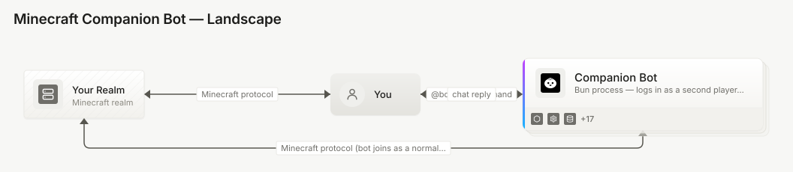
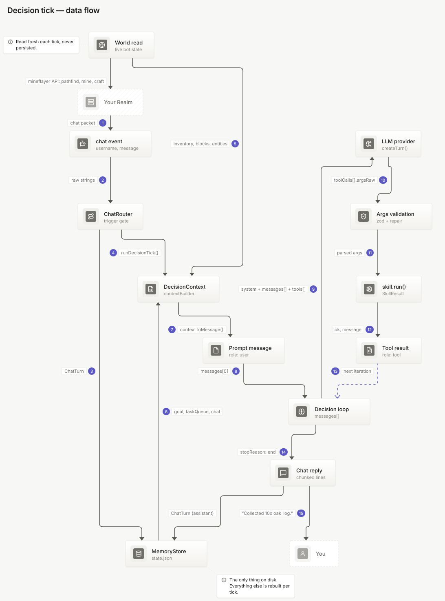
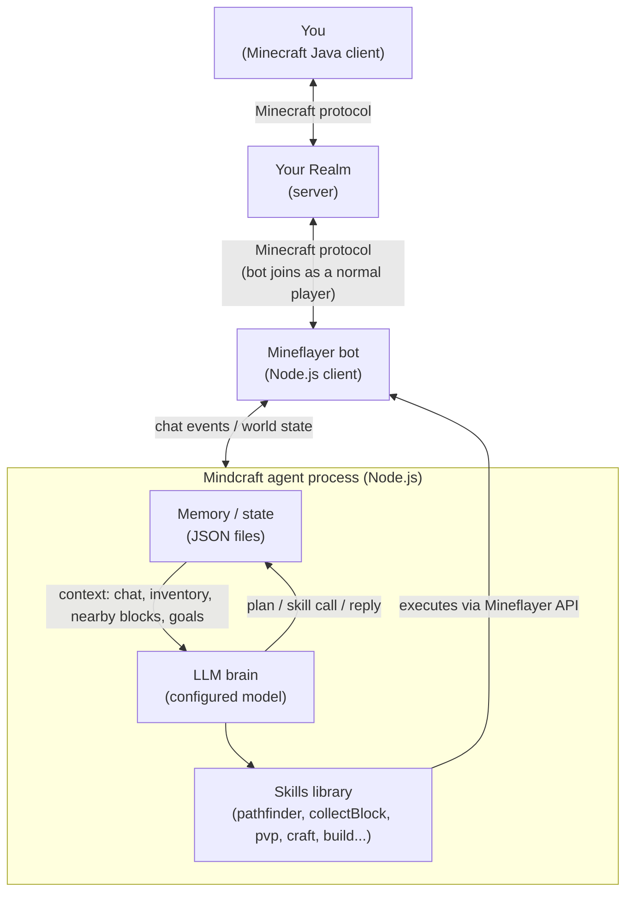
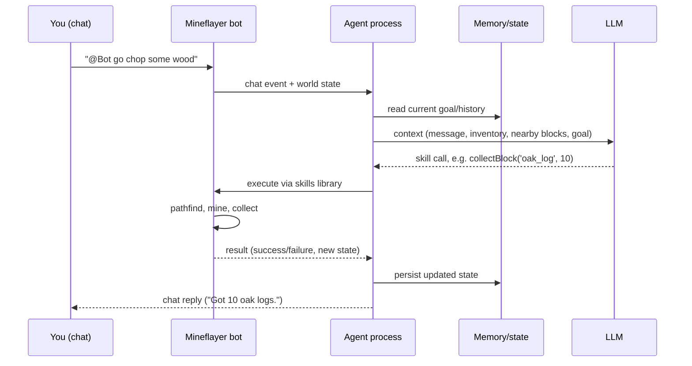
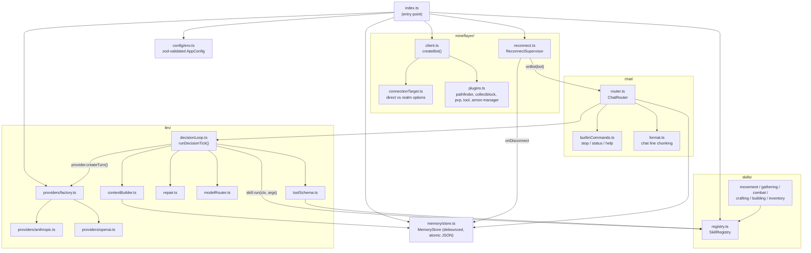

# Architecture

## Components

1. **Minecraft Realm** — the existing Java Edition realm, unmodified. No plugins or mods needed server-side.
2. **Bot account** — a second Microsoft/Minecraft account, invited to the realm like any other player. Mineflayer authenticates as this account.
3. **Mineflayer client** — a [Bun](https://bun.sh) process that logs in via Microsoft auth and speaks the Minecraft protocol directly. To the server it looks like a normal player.
4. **Skills library** — functions built on Mineflayer plugins (`mineflayer-pathfinder`, `mineflayer-collectblock`, `mineflayer-pvp`, etc.): `goToPlayer()`, `collectBlock()`, `craftItem()`, `attackNearest()`, and so on.
5. **LLM brain** — on each chat command or decision tick, packages up context (message, inventory, nearby blocks/entities, current goal) and sends it to the configured model, which returns a skill call or short generated snippet to execute. See [model-options.md](model-options.md) for model selection.
6. **Memory/state** — local JSON files holding conversation history, current goal/plan, and anything the bot has learned (e.g. chest locations), giving it continuity across turns.

## Squinch diagram

A [Squinch](https://github.com/jquatier/squinch) model of the same architecture lives at
[`diagrams/architecture/architecture.squinch`](diagrams/architecture/architecture.squinch), with a
landscape view, a full-detail view of the `src/` module map, and a flow view for the chat-command
interaction. The landscape view is below; open
[`diagrams/architecture/architecture.html`](diagrams/architecture/architecture.html) for the
interactive version with all three (click to zoom into `bot`, switch light/dark).

## Data flow — what actually moves

The diagrams above are structure.
[`diagrams/data-flow/data-flow.squinch`](diagrams/data-flow/data-flow.squinch) models one decision
tick as *data*: the numbered hops from chat packet to chat reply. Open
[`diagrams/data-flow/data-flow-payloads.html`](diagrams/data-flow/data-flow-payloads.html) to see
the diagram beside the real payload at every hop — the `ChatTurn`, the world read, the on-disk
`BotState`, the `DecisionContext`, the flattened prompt, `toolCalls[].argsRaw`, the `SkillResult`,
and the growing `messages[]` — or
[`diagrams/data-flow/data-flow.html`](diagrams/data-flow/data-flow.html) for the
interactive/step-through version.

## Component diagram

## Interaction loop

## Implementation module map

The diagrams above describe the design; this reflects the actual `src/` layout it was built into.
Arrows show the real import/call direction between modules, not just conceptual data flow.

Key boundaries worth calling out:

- **The multi-turn loop lives once, in `decisionLoop.ts`.** Both provider adapters
  (`providers/anthropic.ts`, `providers/openai.ts`) implement only a single stateless
  `createTurn()` translating to/from a normalized shape — adding a new provider (e.g. Groq) is one
  new adapter file plus one line in `factory.ts`, not a second copy of the loop/repair/escalation
  logic.
- **Skills never talk to the LLM layer directly.** `toolSchema.ts` is the only module that converts
  a `SkillRegistry` into provider tool definitions; skills themselves just implement
  `run(ctx, args): Promise<SkillResult>`.
- **`ReconnectSupervisor` owns the bot lifecycle, not `ChatRouter`.** Each reconnect creates a new
  `Bot` and a new `ChatRouter` bound to it — state that must survive a reconnect (goals, task
  queue, known locations) lives in `MemoryStore`, not on the router or the bot object.
- **Prompt caching is on by default, but the mechanism differs by provider.** The system prompt
  and tool schemas are static for the process lifetime, yet `decisionLoop.ts` resends them on
  every iteration and every chat trigger — both adapters mark them cacheable to avoid rebilling
  identical input tokens. `providers/anthropic.ts` uses a single `cache_control` breakpoint on the
  system block (Anthropic's cache prefix order is `tools -> system -> messages`, so that one
  breakpoint covers both). `providers/openai.ts` only adds the equivalent breakpoint when routed
  through OpenRouter to a model family that needs it explicitly (Anthropic, Google Gemini, Alibaba
  Qwen) — OpenAI, DeepSeek, Groq, Grok, Moonshot, Z.AI, and Gemini 2.5+ already cache automatically
  with no request changes. Future cost-tracking work should know cache usage is reported in
  different places: `response.usage.cache_read_input_tokens` /
  `response.usage.cache_creation_input_tokens` for native Anthropic, versus
  `response.usage.prompt_tokens_details.cached_tokens` / `cache_write_tokens` for the OpenAI/
  OpenRouter chat-completions shape.

## Practical caveats

- **Second account required** — the bot needs its own Microsoft/Minecraft Java account invited to the realm; it can't share your account.
- **Needs to stay running** — the Bun process (and a host machine) must be online whenever the bot should be present.
- **API costs** — each bot decision is an LLM call; cost scales with how chatty/active the bot is. See [model-options.md](model-options.md) for cheaper alternatives to frontier models.
- **Java Edition only** — this stack depends on Mineflayer's protocol support, which doesn't exist for Bedrock Realms.
